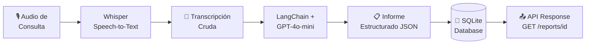

# 🏥 MediScribe AI

### Backend para Automatización de Informes Clínicos

[](https://python.org)
[](https://fastapi.tiangolo.com)
[](https://langchain.com)
[](LICENSE)

> **MediScribe AI** transforma grabaciones de consultas médicas en informes clínicos estructurados mediante inteligencia artificial, ahorrando a los profesionales de la salud hasta un 70% del tiempo dedicado a documentación.

---

## 📋 Tabla de Contenidos

- [Descripción](#-descripción)
- [Arquitectura](#-arquitectura)
- [Flujo de Datos](#-flujo-de-datos)
- [Instalación](#-instalación)
- [Uso de la API](#-uso-de-la-api)
- [Tests](#-tests)
- [Estructura del Proyecto](#-estructura-del-proyecto)
- [Roadmap](#-roadmap)

---

## 🎯 Descripción

MediScribe AI es un backend MVP que automatiza la generación de informes médicos a partir de audio de consultas clínicas. El sistema implementa un pipeline de IA de dos fases:

1. **Speech-to-Text (Whisper)**: Transcripción automática del audio de la consulta.
2. **NLP/LLM (GPT-4o-mini via LangChain)**: Estructuración inteligente de la transcripción en secciones clínicas estándar.

### Secciones del Informe Generado

| Sección | Descripción |
|---------|-------------|
| 🩺 Motivo de Consulta | Razón principal de la visita |
| 📜 Antecedentes | Historial médico relevante |
| 🔬 Examen Físico | Hallazgos de la exploración |
| 🏷️ Diagnóstico Presuntivo | Impresión diagnóstica |
| 💊 Plan de Tratamiento | Medicación, estudios y seguimiento |

---

## 🏗️ Arquitectura

```
┌─────────────────────────────────────────────────────────┐
│                    FastAPI (REST API)                     │
│                    /api/v1/...                            │
├─────────────────────────────────────────────────────────┤
│                   Services Layer                         │
│  ┌──────────────┐  ┌──────────────┐  ┌──────────────┐  │
│  │ Transcription│  │    LLM       │  │   Report     │  │
│  │  (Whisper)   │──│  Structurer  │──│   Service    │  │
│  │  Simulation  │  │ (LangChain)  │  │  (CRUD)      │  │
│  └──────────────┘  └──────────────┘  └──────────────┘  │
├─────────────────────────────────────────────────────────┤
│              SQLAlchemy (Async ORM)                       │
│              SQLite Database                              │
└─────────────────────────────────────────────────────────┘
```

---

## 🔄 Flujo de Datos



---

## 🚀 Instalación

### Prerequisitos

- Python 3.11+
- pip

### Pasos

```bash
# 1. Clonar el repositorio
git clone https://github.com/tu-usuario/mediscribe-ai-backend.git
cd mediscribe-ai-backend

# 2. Crear entorno virtual
python -m venv venv

# Windows
venv\Scripts\activate

# macOS/Linux
source venv/bin/activate

# 3. Instalar dependencias
pip install -r requirements.txt

# 4. Configurar variables de entorno
copy .env.example .env
# Editar .env y agregar tu OPENAI_API_KEY (opcional para modo demo)

# 5. Ejecutar el servidor
uvicorn app.main:app --reload
```

El servidor estará disponible en: **http://localhost:8000**

📖 **Swagger UI**: http://localhost:8000/docs
📘 **ReDoc**: http://localhost:8000/redoc

> 💡 **Modo Demo**: Si no configuras `OPENAI_API_KEY`, el sistema funciona con datos simulados, perfecto para probar la arquitectura sin costes de API.

---

## 📡 Uso de la API

### Health Check

```bash
curl http://localhost:8000/api/v1/health
```

```json
{
  "status": "ok",
  "version": "0.1.0",
  "debug": true
}
```

### Generar Informe Médico (Demo)

```bash
curl -X POST http://localhost:8000/api/v1/upload-audio \
  -H "Content-Type: application/json" \
  -d '{"patient_id": "PAC-2024-001"}'
```

### Generar Informe con Transcripción Custom

```bash
curl -X POST http://localhost:8000/api/v1/upload-audio \
  -H "Content-Type: application/json" \
  -d '{
    "patient_id": "PAC-2024-002",
    "transcription_text": "Doctor: ¿Qué le trae por aquí? Paciente: Tengo fiebre desde hace 3 días y dolor de garganta..."
  }'
```

### Obtener Informe por ID

```bash
curl http://localhost:8000/api/v1/reports/1
```

### Listar Informes (paginado)

```bash
curl "http://localhost:8000/api/v1/reports?skip=0&limit=10"
```

### Ejemplo con Python `requests`

```python
import requests

# Crear informe
response = requests.post(
    "http://localhost:8000/api/v1/upload-audio",
    json={"patient_id": "PAC-2024-003"}
)
report = response.json()
print(f"Informe #{report['id']} — Estado: {report['status']}")
print(f"Diagnóstico: {report['structured_report']['diagnostico_presuntivo']}")
```

---

## 🧪 Tests

```bash
# Ejecutar todos los tests
pytest -v

# Con cobertura
pytest --cov=app tests/
```

Los tests utilizan una base de datos SQLite in-memory y el modo mock del LLM, por lo que **no requieren API key**.

---

## 📁 Estructura del Proyecto

```
mediscribe-ai-backend/
├── app/
│   ├── __init__.py
│   ├── main.py                 # Entry point FastAPI
│   ├── api/
│   │   ├── __init__.py
│   │   └── routes.py           # Endpoints REST
│   ├── core/
│   │   ├── __init__.py
│   │   ├── config.py           # Settings (pydantic-settings)
│   │   └── database.py         # Async SQLAlchemy engine
│   ├── models/
│   │   ├── __init__.py
│   │   └── report.py           # ORM model
│   ├── schemas/
│   │   ├── __init__.py
│   │   └── report.py           # Pydantic schemas
│   └── services/
│       ├── __init__.py
│       ├── transcription.py    # Whisper simulation
│       ├── llm_structurer.py   # LangChain + GPT integration
│       └── report_service.py   # Business logic
├── tests/
│   ├── __init__.py
│   ├── conftest.py             # Test fixtures
│   └── test_api.py             # API tests
├── .env.example                # Environment template
├── .gitignore
├── pytest.ini
├── requirements.txt
└── README.md
```

---

## 🗺️ Roadmap (Siguientes Pasos)

- [ ] 🎙️ **Integración real con Whisper API** — Procesamiento de archivos de audio (.wav, .mp3, .m4a)
- [ ] 🌍 **Soporte para múltiples idiomas** — Detección automática y transcripción multilingüe
- [ ] 🏥 **Validación médica avanzada** — Integración con terminología SNOMED-CT / CIE-11
- [ ] 🔐 **Autenticación JWT** — Control de acceso y roles (médico, admin, auditor)
- [ ] 📊 **Dashboard de Analytics** — Métricas de uso, informes por período, estadísticas
- [ ] 🐳 **Containerización Docker** — Despliegue con Docker Compose
- [ ] ☁️ **Deploy en Cloud** — CI/CD con GitHub Actions → AWS/GCP
- [ ] 📱 **API Gateway** — Rate limiting, API keys, versionado avanzado

---

## 📄 Licencia

Este proyecto está bajo la licencia MIT. Ver [LICENSE](LICENSE) para más detalles.

---

<div align="center">

**Hecho con ❤️ y 🤖 para el futuro de la documentación clínica**

*MediScribe AI — Porque el tiempo del médico debería estar con el paciente, no con el papeleo.*

</div>
