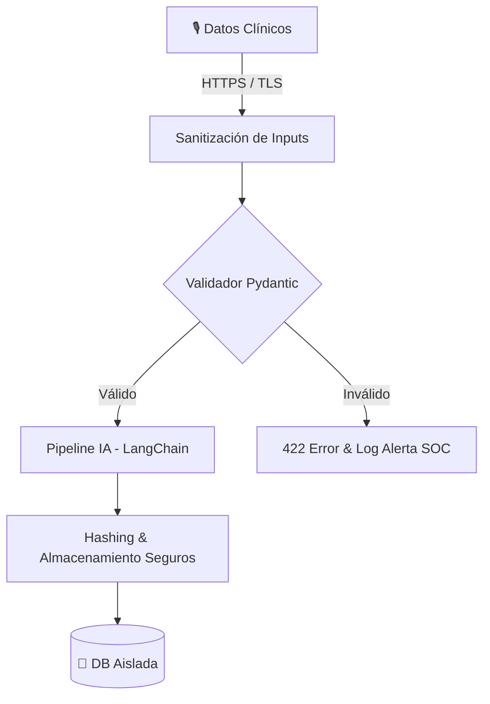

# 🏥 Secure-MediScribe Backend

### AI-Powered Clinical Report Automation with DevSecOps Framework

[](https://python.org)
[](https://fastapi.tiangolo.com)
[](https://github.com/franamaro-dev/mediscribe-ai-backend)
[](LICENSE)

> **MediScribe AI** transforming clinical raw data into structured, secure reports. Built with a **Security-First** mindset to ensure PHI (Protected Health Information) integrity and system resilience.

---

## 📋 Tabla de Contenidos

- [Descripción](#-descripción)
- [Arquitectura de Seguridad](#🛡️-arquitectura-de-seguridad)
- [Flujo de Datos Seguro](#-flujo-de-datos-seguro)
- [Instalación](#-instalación)
- [Uso de la API](#-uso-de-la-api)
- [Tests](#-tests)
- [Estructura del Proyecto](#-estructura-del-proyecto)
- [Roadmap (Cybersecurity Focus)](#-roadmap)

---

## 🎯 Descripción

MediScribe AI es un backend robusto que automatiza la generación de informes médicos. A diferencia de otros MVPs, este proyecto integra capas de validación y auditoría desde su concepción, preparando el terreno para cumplimientos tipo HIPAA/GDPR.

---

## 🛡️ Arquitectura de Seguridad (SOC Analyst Perspective)

El sistema implementa defensas proactivas para mitigar riesgos del OWASP Top 10:

1.  **Validación de Esquemas (Anti-Injection)**: Uso estricto de Pydantic para sanitizar inputs y prevenir inyecciones de datos maliciosos en el pipeline de IA.
2.  **Soberanía del Dato**: Arquitectura diseñada para despliegues *On-Premise* o VNETs privadas, garantizando que los datos clínicos no abandonen el perímetro controlado.
3.  **Audit-Ready Logging**: Trazabilidad completa de las peticiones para análisis forense y detección de anomalías.
4.  **Least Privilege**: Gestión de dependencias y variables de entorno (`.env`) diseñada para el principio de menor privilegio en entornos Docker.

### Pipeline de Datos Resiliente

```
┌─────────────────────────────────────────────────────────┐
│              FastAPI (Hardened REST Layer)                │
│              - Input Sanitization & Validation            │
├─────────────────────────────────────────────────────────┤
│                   Services Layer                         │
│  ┌──────────────┐  ┌──────────────┐  ┌──────────────┐  │
│  │ Integrity    │  │ Secure LLM   │  │   Audit      │  │
│  │ Validations  │──│ Integration  │──│   Service    │  │
│  │ (Whisper)    │  │ (LangChain)  │  │   (Storage)  │  │
│  └──────────────┘  └──────────────┘  └──────────────┘  │
├─────────────────────────────────────────────────────────┤
│              SQLAlchemy (Encapsulated ORM)                │
│              SQLite Performance & Isolation               │
└─────────────────────────────────────────────────────────┘
```

---

## 🔄 Flujo de Datos Seguro



---

## 🚀 Instalación

### Prerequisitos

- Python 3.11+
- Secure Environment Configuration (Venv)

### Pasos

```bash
# 1. Clonar el repositorio
git clone https://github.com/franamaro-dev/mediscribe-ai-backend.git
cd mediscribe-ai-backend

# 2. Hardening del entorno virtual
python -m venv venv
# Windows: venv\Scripts\activate | Unix: source venv/bin/activate

# 3. Instalación de dependencias securizadas
pip install -r requirements.txt

# 4. Gestión de Secretos
# NUNCA compartas tu .env. Usa variables de entorno protegidas.
cp .env.example .env 
```

---

## 📡 Uso de la API (Monitorización)

### Health Check (Audit Point)

```bash
curl http://localhost:8000/api/v1/health
```

---

## 🧪 Tests

```bash
# Ejecutar suite de validación
pytest -v
```

---

## 🗺️ Roadmap (Cybersecurity & Compliance)

- [ ] 🔐 **Autenticación JWT & RBAC** — Control de acceso basado en roles para personal médico y auditores.
- [ ] 📝 **Audit Logs (SIEM-Ready)** — Exportación de logs en formato Syslog para integración con Wazuh/Splunk.
- [ ] 🏗️ **Hardening de Contenedores** — Dockerfiles Multi-stage y escaneo de vulnerabilidades con Trivy.
- [ ] 🌩️ **Cloud Security** — Infrastructure-as-Code (Terraform) con Security Groups restrictivos.
